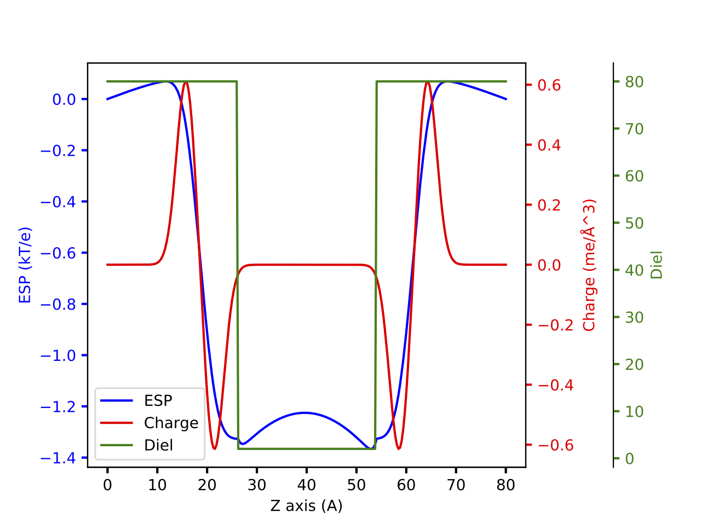
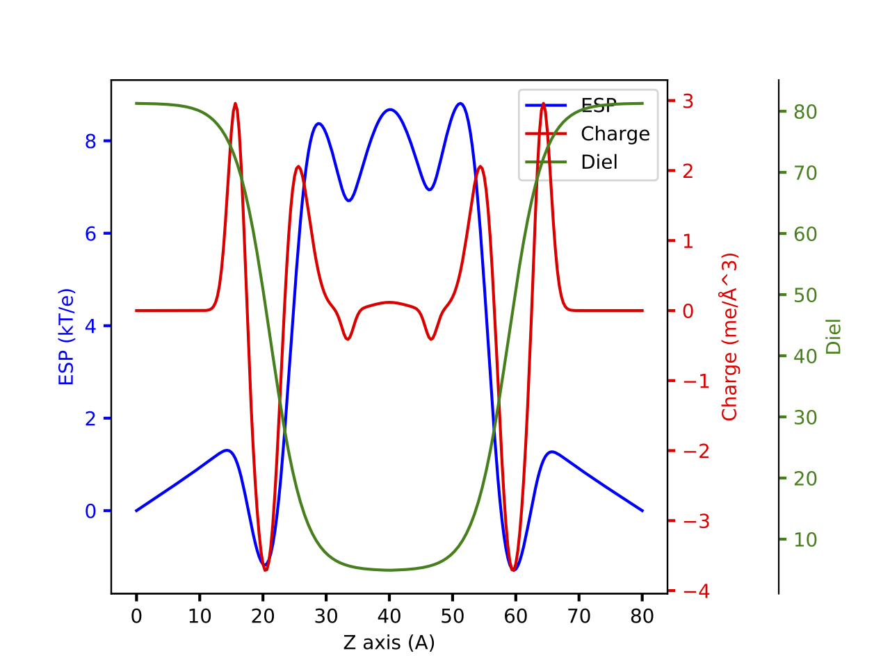

Using the continuum model for the lipid
=======================================

The LipdBase class
------------------
The class :class:`rocklinc.lipid.LipdBase` handles the generation of the dx
files for the APBS calculations and the reading of the result into
:class:`numpy.array`.

To customise the lipid model, the user could redefine
:func:`rocklinc.lipid.diel_model` to the desirable dielectric constant
profile and :func:`rocklinc.lipid.gaussian_mixture` to the desirable
charge density profile.

The binary step lipid model
---------------------------
The binary step lipid model is a simple continuum model that is use to
describe lipid. The charge is modelled with two Gaussians with opposite
magnitude and the dielectric constant is modelled as two region with
different dielectric constants.

.. autofunction:: rocklinc.lipid.StepLipid.diel_model
.. autofunction:: rocklinc.lipid.StepLipid.gaussian_mixture

The model could be used ::

    import numpy as np
    import matplotlib.pyplot as plt
    from rocklinc.lipid import StepLipid, plot_dx

    lipid = StepLipid([80, 80, 80], [257, 257, 257])
    lipid.write_dx_input([6.22602388e-04, 18.5969598, 1.98288109,
                                     24.1998191, 1.91347013],
                          [13.80515, 2, 80])

    lipid.write_apbs_input()
    lipid.run_APBS()
    charge, diel, esp = lipid.read_APBS()
    fig = plot_dx(np.linspace(0, lipid.dim[-1].magnitude, lipid.grid[-1]), charge, diel, esp)
    plt.show()

Will give a plot looks like this

The new lipid model
---------------------------
The new lipid model is a new continuum model that is use to describe lipid.
The charge is modelled with five Gaussians to reproduce the complete
electrostatic potential profile generated with explicit lipid. The dielectric
constant is modelled with logistic function to reproduce the smooth
switching from low to high dielectric constant region.

.. autofunction:: rocklinc.lipid.CurveLipid.diel_model
.. autofunction:: rocklinc.lipid.CurveLipid.gaussian_mixture

The model could be used ::

    import numpy as np
    import matplotlib.pyplot as plt
    from rocklinc.lipid import CurveLipid, plot_dx

    lipid = CurveLipid([80, 80, 80], [257, 257, 257])
    lipid.write_dx_input([24.1998191, 1.28409182, 3.29937546e-03,
                          18.5969598, 2.41286946, 5.70594706e-03,
                          16.0770291, 2.47034776, 4.17737240e-03,
                          6.59972225, 0.90515386, 4.25321040e-04,
                          2.95472778, 1.17224618e-04],
                          [0.36626031, 18.87278382, 76.49060424, 4.83151723])

    lipid.write_apbs_input()
    lipid.run_APBS()
    charge, diel, esp = lipid.read_APBS()
    fig = plot_dx(np.linspace(0, lipid.dim[-1].magnitude, lipid.grid[-1]), charge, diel, esp)
    plt.show()

Will give a plot looks like this

API Reference
-------------
.. autoclass:: rocklinc.lipid.LipdBase
    :members:
    :inherited-members: